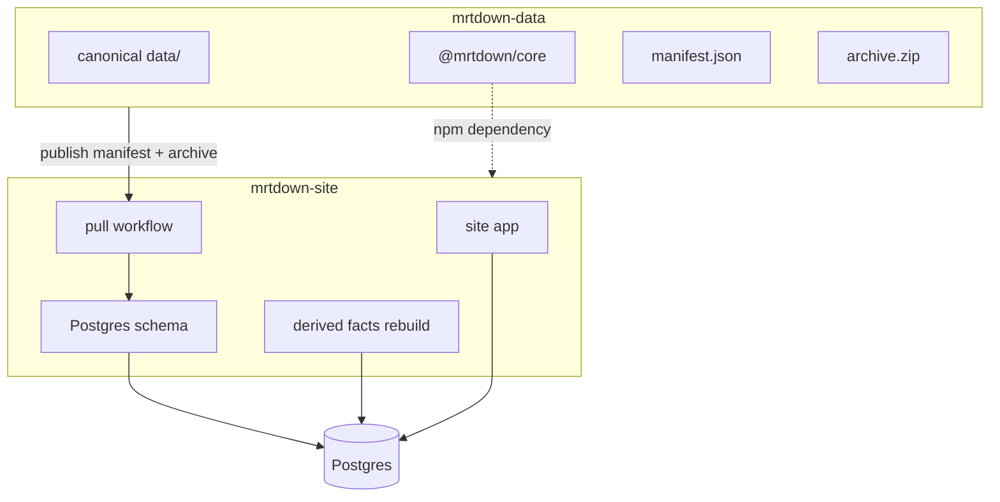
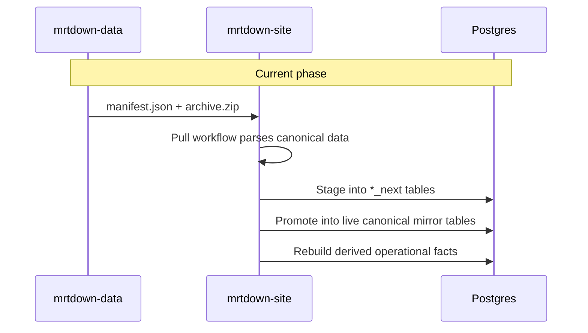

# RFC: Two-Repo Postgres Architecture

This document supersedes the older three-repo plan that split responsibilities across `mrtdown-data`, `mrtdown-server`, and `mrtdown-site`.

`mrtdown-site` now supersedes `mrtdown-server`. The site repo owns the application, the Postgres schema, the import workflow, and any future public or self-serve APIs.

Last updated: 2026-04-21 (America/Los_Angeles)

## Status

This RFC is intentionally phase-based.

- Phase 1 is the current priority: get `mrtdown-site` back up on the new architecture.
- Phase 2 is a follow-up: add crowd-sourced reports, live signals, moderation, and promotion back into the canonical repo.

The most important consequence is:

- **Phase 1 only requires one-way sync from `mrtdown-data` to `mrtdown-site`.**
- Bidirectional flows are not required to restore the site.

## Decisions Summary

- **Repo structure**: two repos
  - `mrtdown-data`: canonical curated dataset, schemas, repository helpers
  - `mrtdown-site`: web app, Postgres schema, import pipeline, derived facts, future APIs
- **Canonical source of truth**: `mrtdown-data`
- **Live operational source of truth**: Postgres inside `mrtdown-site`
- **Current phase sync**: one-way canonical sync from repo to site database
- **Future crowd model**: live-only tables in `mrtdown-site`, with promotion to `mrtdown-data` by PR
- **Publishing**: `@mrtdown/core` remains the shared npm package for schemas, repo readers, and shared helpers
- **Non-goal for current phase**: crowd reporting and db-to-repo promotion are deferred

## Why This Change

The older plan introduced `mrtdown-server` as a dedicated API and sync repo. That separation no longer pays for itself.

`mrtdown-site` already contains the pieces that matter:

- the Postgres schema and migrations
- the import workflow from `mrtdown-data`
- the derived operational fact rebuilds
- the app surface where future self-serve management would naturally live

Creating and maintaining a third repo would only add dependency management and deployment overhead without creating a meaningful architectural boundary.

## Repo Responsibilities

### `mrtdown-data`

This repo remains the canonical, reviewable history.

It owns:

- static network definitions
- curated issues
- append-only `evidence.ndjson`
- append-only `impact.ndjson`
- schema contracts and repository helpers

It does not own:

- live ingestion
- anonymous/public writes
- runtime aggregation
- operational moderation state

### `mrtdown-site`

This repo owns the runtime system.

It owns:

- the web frontend
- Postgres schema and migrations
- canonical import from `mrtdown-data`
- rebuildable derived facts used by the site
- future live crowd-report ingestion
- future moderation and promotion workflows

## Architecture Overview

## Source Of Truth Rules

- `mrtdown-data` is authoritative for canonical history.
- `mrtdown-site` Postgres is authoritative for runtime state and rebuildable derived tables.
- Canonical data can be mirrored into Postgres.
- Runtime state must not silently overwrite canonical history.

For Phase 1, this simplifies to one practical rule:

- **Git wins.** If a value exists in both places, the canonical repo is the source of truth.

## Phase 1: Site Bring-Up

### Goal

Restore `mrtdown-site` using Postgres backed by canonical data imported from `mrtdown-data`.

### Why One-Way Sync Is Enough

For the current bring-up, the site only needs:

- a reliable import of canonical entities and issues
- stable derived fact tables for analytics and profile pages
- repeatable rebuilds when canonical data changes

Nothing in that requirement set needs Postgres to write back into the repo.

That means the existing import pipeline is sufficient for this phase.

### Phase 1 Sync Flow

### Phase 1 Notes

- The pull is hash-aware and staging-based.
- Import should be idempotent and safe to re-run.
- Derived facts are rebuildable outputs, not canonical source.
- Analytics export back into `mrtdown-data` is optional for this phase and can be deferred if it slows the bring-up.

## Current Implementation Direction

As of this RFC update, `mrtdown-site` already contains the core of the Phase 1 architecture:

- a manifest + archive pull flow
- staging tables (`*_next`)
- promotion into live tables
- derived operational fact rebuilds

That implementation is the reference architecture going forward. Documentation should describe it, not the retired `mrtdown-server` concept.

## Phase 2: Crowd-Sourced Reports

Crowd-sourcing is explicitly a follow-up phase.

The motivation is clear:

- official operators and agencies sometimes under-report, delay reporting, or omit incidents entirely
- the system still needs to surface probable disruption signals to users in near real time

That leads to an important product rule:

- **Official silence is not evidence of normal service.**

### Crowd Design Principles

- Crowd reports are operationally useful before they are historically trusted.
- Crowd data may escalate a live status faster than it can de-escalate one.
- Canonical history still requires review.
- Live crowd state must be stored separately from the mirrored canonical issue tables.

### Proposed Live-Only Tables In `mrtdown-site`

- `crowd_reports`
  - raw append-only submissions
- `crowd_signals`
  - aggregated rolling windows by affected entity and effect
- `crowd_signal_links`
  - which reports contributed to which signal
- `crowd_promotions`
  - candidate canonical actions and their review/export state

### Promotion Rule

Postgres should propose canonical changes, not finalize them.

The intended flow is:

1. crowd reports create or strengthen a live signal in `mrtdown-site`
2. a promotion job produces a candidate canonical bundle
3. that bundle becomes a PR against `mrtdown-data`
4. human review decides whether it becomes history
5. merge triggers the normal repo-to-site import

This keeps the trust boundary simple:

- live DB for operational truth
- git history for reviewed canonical truth

### Canonical Evidence Impact

If crowd aggregates become canonical after review, the evidence schema will likely need an explicit aggregate-oriented type rather than overloading existing source types.

Current likely direction:

- add a canonical evidence type such as `crowd.aggregate`

This is a follow-up schema change, not a Phase 1 requirement.

## Dual Source Of Truth

The system is intentionally asymmetric.

- **Canonical layer**: `mrtdown-data`
- **Runtime layer**: `mrtdown-site` Postgres

The flows should also stay asymmetric:

- **Phase 1**
  - `mrtdown-data` -> `mrtdown-site`
- **Phase 2**
  - `mrtdown-site` -> PR into `mrtdown-data` for reviewed crowd promotion

This is not generic bidirectional sync. It is two separate one-way pipelines with different trust levels.

## Migration Path

### Phase 1

1. Treat `mrtdown-site` as the replacement for `mrtdown-server`.
2. Keep `mrtdown-data` as the canonical source.
3. Finish and harden the existing pull/import flow in `mrtdown-site`.
4. Rebuild the derived fact tables needed for the site.
5. Bring the site back up on this architecture.

### Phase 2

1. Add live crowd-report ingestion tables and endpoints in `mrtdown-site`.
2. Add rolling signal aggregation and abuse controls.
3. Add promotion candidates and export jobs.
4. Create PR-based promotion into `mrtdown-data`.
5. Add review tooling and moderation rules.

## Risks And Mitigations

### Phase 1 Risks

- Import drift between `mrtdown-data` and `mrtdown-site`
  - Mitigation: continue to use shared schemas and repository helpers from `@mrtdown/core`
- Rebuild cost for derived facts
  - Mitigation: keep facts rebuildable and scoped; do not mix them with canonical source tables
- Old docs causing design confusion
  - Mitigation: this RFC replaces the old three-repo architecture

### Phase 2 Risks

- Spam and brigading
  - Mitigation: rate limiting, reporter dedupe, trust scoring, delayed promotion
- False clears from silence
  - Mitigation: de-escalation rules remain stricter than escalation rules
- Conflating live crowd state with canonical issues
  - Mitigation: separate live-only tables and PR-based promotion

## Bottom Line

For the current phase, the answer is yes:

- **the one-way sync that already exists is sufficient to get `mrtdown-site` back up on the new architecture**

Crowd-sourced reporting is important, but it should be implemented as a separate follow-up phase once the canonical import and site runtime are stable.
