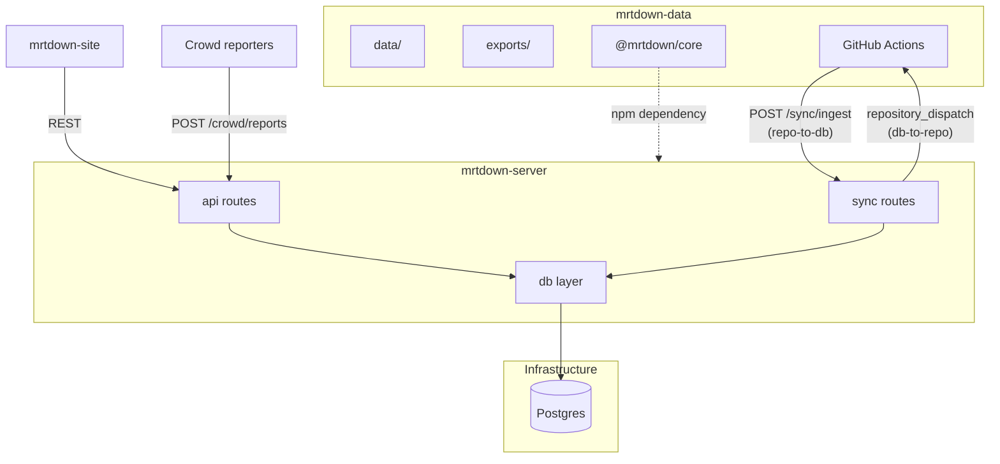
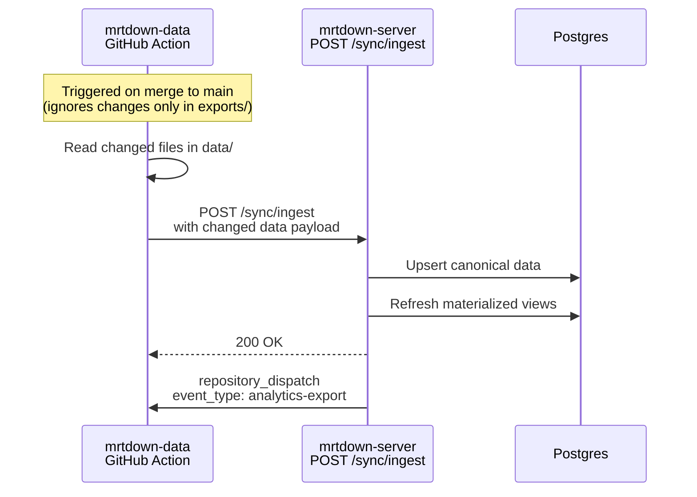
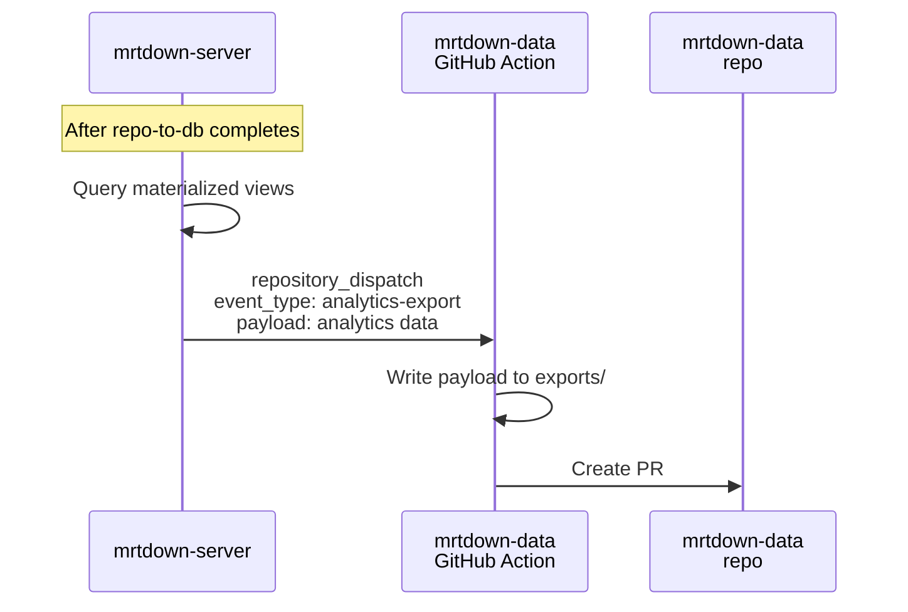
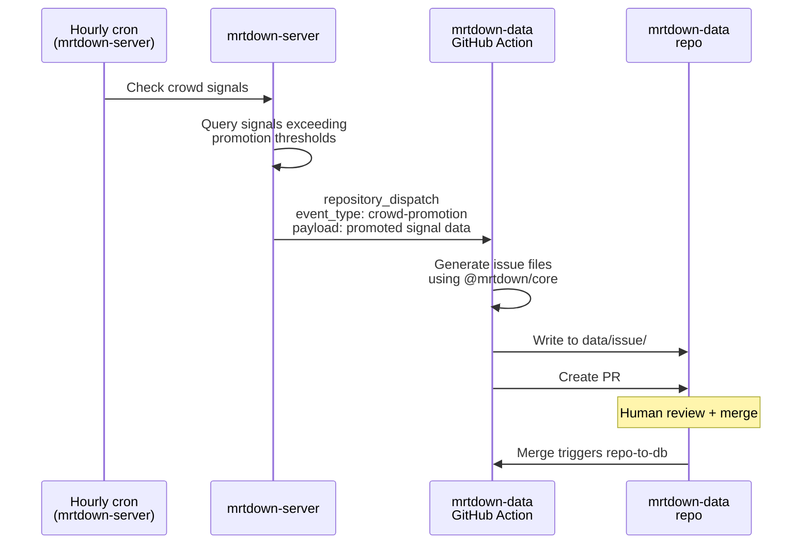
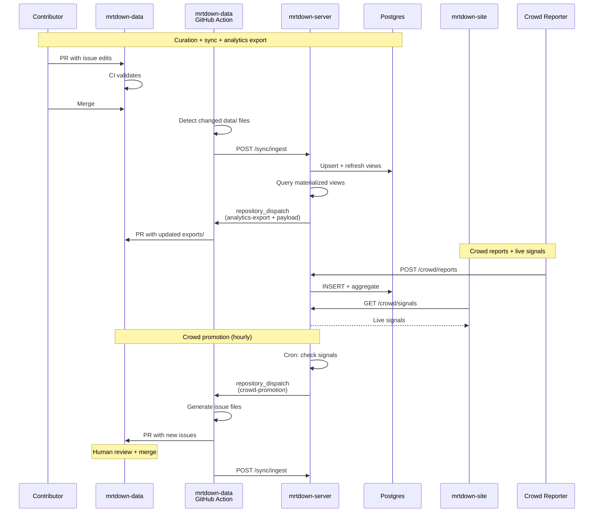

# RFC: Postgres-backed Multi-Repo Architecture

## Decisions Summary

- **Repo structure**: Three repos -- `mrtdown-data` (data + schemas + exports), `mrtdown-server` (single-package server), `mrtdown-site` (web frontend)
- **mrtdown-data**: JSON/NDJSON files, Zod schemas, validation script, analytics exports, contributor-friendly
- **mrtdown-server**: Single package with directory-level separation (`db/`, `api/`, `sync/`)
- **Database**: Postgres on Fly.io, fully replacing DuckDB
- **Query builder**: Kysely
- **Analytics**: Materialized views in Postgres; results exported as static files to mrtdown-data via PR
- **Crowd reports**: Anonymous submissions, rate-limited by IP/fingerprint
- **Crowd moderation**: Automated aggregation + spike detection creates PRs for human review
- **Crowd real-time**: Live crowd signals served to frontend
- **Data format**: Next-gen only (evidence/impact NDJSON); legacy `data/source/` not supported
- **API surface**: Full redesign
- **Publishing**: `@mrtdown/core` published to npm via CI on git tags (schemas, repo layer, helpers -- no data files)
- **Sync mechanism**: repo-to-db via API call; db-to-repo via GitHub Actions `repository_dispatch`

---

## Architecture Overview



---

## Sync Architecture

Sync is split across two systems: **sync routes** in mrtdown-server (`src/api/sync/`) handle database operations, and **GitHub Actions** in mrtdown-data handle file operations and PR creation. There is no standalone sync runtime.

### repo-to-db



- A **GitHub Action in mrtdown-data** triggers on push to main
- The Action detects changed files in `data/` (ignores `exports/`)
- Sends the changed data to the API via `POST /sync/ingest`
- The API upserts to Postgres and refreshes materialized views
- After success, the API fires a `repository_dispatch` back to mrtdown-data to trigger the analytics export

### db-to-repo: analytics export



- Triggered by `repository_dispatch` with `event_type: analytics-export`
- The payload contains the pre-computed analytics data from materialized views
- The Action writes the payload contents to `exports/` and creates a PR -- no callback to the API needed
- Merging this PR does NOT re-trigger repo-to-db (the Action ignores changes only in `exports/`)

### db-to-repo: crowd promotion



- A cron job in mrtdown-server periodically checks for promotable crowd signals
- When signals meet the threshold, the API fires `repository_dispatch` with `event_type: crowd-promotion` and the signal data as payload
- The GitHub Action in mrtdown-data generates properly formatted `issue.json`, `evidence.ndjson`, `impact.ndjson` using `@mrtdown/core`
- Creates a PR for human review
- On merge, the normal repo-to-db flow picks up the new canonical data

### Conflict handling

- repo-to-db is authoritative for canonical data: repo always wins
- db-to-repo only creates new issues or appends evidence to existing issues; never modifies existing canonical data
- If a crowd promotion PR is rejected, the promotion record is marked `rejected` and won't be retried

---

## mrtdown-data (This Repo)

The community-facing data repository. Designed to be approachable for non-developer contributors.

### Layout

```
mrtdown-data/
  package.json                (@mrtdown/core)
  tsconfig.json
  README.md                   (contributor guide)
  CONTRIBUTING.md
  .github/
    workflows/
      validate.yml            (CI: validate data on PR)
      sync.yml                (on merge: call POST /sync/ingest)
      analytics-export.yml    (on repository_dispatch: write exports/)
      crowd-promotion.yml     (on repository_dispatch: write data/issue/)
  src/
    repo/                     (read-only repository layer)
      MRTDownRepository.ts
      common/
        FileStore.ts
        StandardRepository.ts
        store.ts
      issue/
        IssueRepository.ts
        helpers/
          deriveCurrentState.ts
        schema/               (Zod schemas for issues, evidence, impact, etc.)
      station/
      line/
      service/
      operator/
      landmark/
      town/
    helpers/
      resolvePeriods.ts
      normalizeRecurringPeriod.ts
    validate.ts               (CLI: validates all data files against schemas)
  data/
    public_holidays.json
    station/
    line/
    service/
    operator/
    landmark/
    town/
    issue/
      YYYY/MM/<issue-id>/
        issue.json
        evidence.ndjson
        impact.ndjson
  exports/                    (generated by server, not manually edited)
    uptime-by-line.csv
    issue-counts-by-line.csv
    issue-counts-cumulative.csv
    ...
```

### What lives here

- **Data files** (`data/`): The canonical JSON/NDJSON dataset. This is what community contributors edit.
- **Analytics exports** (`exports/`): Pre-computed analytics generated by the server. Not manually edited -- updated via automated PRs. Accessible to researchers and non-SWEs without needing the API.
- **Zod schemas** (`src/repo/*/schema/`): Define the exact shape of every data file. These are the contract.
- **Repository layer** (`src/repo/`): Read-only utilities for loading data files into typed objects.
- **Validation script** (`src/validate.ts`): Run `npm run validate` to check all data files against schemas. CI runs this on every PR.
- **Helpers** (`src/helpers/`): Period resolution, recurring period normalization -- logic tied to the data format.
- **GitHub Actions** (`.github/workflows/`): Sync workflows for repo-to-db, analytics export, and crowd promotion.

### What does NOT live here

- No Postgres, no Kysely, no Hono, no API code
- No crowd report logic
- No analytics computation (only the exported results)
- Dependencies are minimal: Zod, Luxon, rrule-rust, json-nd

### Contributor experience

A data contributor's workflow:

1. Fork the repo
2. Edit/create JSON files in `data/`
3. Run `npm run validate` to check their changes
4. Open a PR -- CI validates automatically

The repo looks like a dataset with a small validation library, not a software project. Contributors never need to think about `exports/`, `src/`, or `.github/`.

### Publishing

`@mrtdown/core` is published to npm via CI when a git tag is pushed (e.g. `v1.0.0`). One-time setup; automated thereafter.

The published package contains **only compiled code** (schemas, repo layer, helpers) -- no data files, no exports. Data files are consumed by the sync Action via filesystem reads. Exports are for human/researcher consumption only.

The server repo depends on `@mrtdown/core` for:

- Zod schemas (type definitions and runtime validation)
- `MRTDownRepository` + `FileStore` (used by sync routes to parse incoming data)
- Period helpers (used by API for time calculations)

When schemas change, tag a new release, CI publishes, and mrtdown-server bumps the dependency version.

---

## mrtdown-server (New Repo)

A single Node.js package. Directory-level separation keeps concerns clear without the overhead of npm workspaces -- `db/` owns the database (schema, migrations, connection, materialized views) and `api/` owns the server (routes, queries, middleware). The dependency direction is `api/ → db/`, never the reverse.

### Layout

```
mrtdown-server/
  package.json
  tsconfig.json
  biome.json
  src/
    db/
      schema/                 (Kysely table type definitions)
      migrations/             (forward-only SQL migrations)
      connection.ts           (Postgres pool)
      materialized/           (materialized view definitions + refresh)
    api/
      index.ts                (Hono app entry point)
      routes/                 (route handlers)
      queries/                (Kysely queries + raw SQL for analytics)
      middleware/             (auth, rate-limiting, CORS)
      crowd/                  (crowd report ingestion + signal aggregation)
      sync/                   (sync route handlers)
        ingest.ts             (POST /sync/ingest -- repo-to-db)
        promote.ts            (cron logic for crowd promotion dispatch)
    index.ts                  (entry point)
```

`@mrtdown/core` is the sole external workspace dependency (npm package from mrtdown-data), providing Zod schemas, the repository layer, and period helpers. If a second consumer of `db/` emerges later (e.g. a standalone worker), extracting to npm workspaces is straightforward.

---

## mrtdown-site (Separate Repo)

The web frontend for MRTDown. Consumes the mrtdown-server REST API to display system status, issue history, line profiles, analytics, and live crowd signals. This repo is independent -- it has no direct dependency on mrtdown-data or Postgres.

---

## Server Details

### Database layer (`src/db/`)

Postgres schema via Kysely, migrations, and materialized views.

**Schema** (ported from current DuckDB tables in `src/db/generate/index.ts`):

- Core: `stations`, `towns`, `landmarks`, `operators`, `lines`, `line_operators`, `services`, `service_revisions`, `service_revision_stations`
- Issues: `issues`, `issue_evidences`, `issue_impact_events`, `issue_impact_event_basis`, `issue_periods_canonical`, `issue_periods_normalized`, `issue_service_effects`, `issue_facility_effects`, `issue_stations`, `issue_causes`
- Reference: `metadata`, `public_holidays`

**New tables for crowd-sourcing:**

```sql
CREATE TABLE crowd_reports (
  id TEXT PRIMARY KEY,
  created_at TIMESTAMPTZ NOT NULL DEFAULT now(),
  reporter_fingerprint TEXT NOT NULL,
  line_id TEXT REFERENCES lines(id),
  station_id TEXT REFERENCES stations(id),
  effect_kind TEXT NOT NULL,
  free_text TEXT,
  expires_at TIMESTAMPTZ NOT NULL
);

CREATE TABLE crowd_signals (
  id TEXT PRIMARY KEY,
  window_start TIMESTAMPTZ NOT NULL,
  window_end TIMESTAMPTZ NOT NULL,
  line_id TEXT REFERENCES lines(id),
  station_id TEXT REFERENCES stations(id),
  report_count INTEGER NOT NULL,
  spike_score REAL,
  dominant_effect TEXT,
  is_active BOOLEAN NOT NULL DEFAULT true
);

CREATE TABLE crowd_signal_promotions (
  id TEXT PRIMARY KEY,
  crowd_signal_id TEXT NOT NULL REFERENCES crowd_signals(id),
  issue_id TEXT REFERENCES issues(id),
  promoted_at TIMESTAMPTZ NOT NULL,
  pr_url TEXT,
  status TEXT NOT NULL DEFAULT 'pending'
);
```

**Materialized views** for analytics:

- `mv_line_uptime_daily` -- per-line, per-day uptime ratio
- `mv_issue_counts_cumulative` -- running totals by line/type
- `mv_service_window_hours` -- pre-computed service hours per day
- Refreshed after each repo-to-db sync

**Migrations:** Kysely's migration system. Forward-only, timestamp-prefixed TypeScript files (e.g. `20260308_001_initial_schema.ts`). The database is persistent -- no "rebuild from scratch" like the current DuckDB approach. Migrations run as an explicit step (`npm run db:migrate` or a pre-deploy hook), not on every request.

### API layer (`src/api/`)

Hono web server with redesigned API surface.

**Sync routes:**

- `POST /sync/ingest` -- accepts canonical data from mrtdown-data's GitHub Action, upserts to Postgres, refreshes materialized views, then fires `repository_dispatch` for analytics export with the computed data in the payload

**Crowd report endpoints:**

- `POST /crowd/reports` -- submit (anonymous, rate-limited by fingerprint)
- `GET /crowd/signals` -- active crowd signals (for frontend real-time display)
- `GET /crowd/signals/:lineId` -- signals for a specific line

**Crowd promotion cron:**

- Periodically checks for crowd signals exceeding promotion thresholds
- Fires `repository_dispatch` on mrtdown-data with `event_type: crowd-promotion` and the promoted signal data as payload

**Rate limiting:**

- Per-fingerprint: max N reports per M minutes
- Global: max R reports per second
- Fingerprint = hash(IP + User-Agent), stored only as hash

**Real-time signal serving:**

- Start with polling (`GET /crowd/signals` with short cache TTL)
- Add SSE later if needed

**Query approach:**

- Simple CRUD: Kysely query builder
- Complex analytics: raw SQL via Kysely's `sql` tag, reading from materialized views
- JSON handling: Postgres `jsonb` operators replacing DuckDB's native JSON

---

## Data Flow: End to End



---

## Dual Source of Truth

- **mrtdown-data (git)**: Authoritative for curated canonical data (issues, evidence, impact, network definitions). Also holds derived analytics exports (generated, not manually edited).
- **Postgres**: Authoritative for live operational data (crowd reports, crowd signals, aggregations) and computed analytics (materialized views).

The sync flows bridge them asymmetrically:

- Canonical data flows: mrtdown-data GitHub Action -> `POST /sync/ingest` -> Postgres (on merge)
- Derived analytics flow: Postgres -> `repository_dispatch` payload -> mrtdown-data `exports/` (after each sync)
- Crowd data flows: Postgres -> `repository_dispatch` -> mrtdown-data `data/issue/` (hourly, with human review)

The `exports/` directory is a one-way output from the server. It never flows back to Postgres.

---

## Migration Path

Logical ordering (not a sprint plan):

1. **Restructure mrtdown-data** — Done: `next/data/` is now `data/`, old data moved to `legacy/data`. Remaining: keep `src/repo/` and schemas, add `exports/` directory, add validation script, remove API/DuckDB code. Publish as `@mrtdown/core`.
2. **Create mrtdown-server** -- Scaffold single package with `src/db/` and `src/api/` directories.
3. **Implement database layer** -- Kysely schema, initial migration, connection pool, stand up Fly Postgres.
4. **Implement sync routes** -- `POST /sync/ingest` and `GET /sync/exports` in the API.
5. **Implement GitHub Actions** -- `sync.yml`, `analytics-export.yml` in mrtdown-data.
6. **Migrate API** -- Rewrite queries for Postgres/Kysely, redesign API surface.
7. **Add crowd reports** -- New endpoints, crowd tables, aggregation, real-time signals.
8. **Implement crowd promotion** -- Cron job, `repository_dispatch`, `crowd-promotion.yml` Action.

---

## Risks and Mitigations

**Analytical query performance on Postgres**

- Current DuckDB queries use heavy CTEs for uptime, service windows, cumulative counts
- At current data volume (hundreds of issues), Postgres is adequate
- Materialized views pre-compute expensive aggregations; refreshed after each sync

**Cross-repo dependency management**

- `@mrtdown/core` schema changes need a tag + publish + version bump in mrtdown-server
- Mitigation: CI in mrtdown-server can test against `@mrtdown/core@latest` to catch breakage early
- Publishing is automated via CI on git tags, so the overhead is just: tag, wait for CI, bump version in mrtdown-server

**Crowd report spam/abuse**

- Rate limiting by fingerprint, auto-expiry on reports
- Spike detection requires statistical significance, not just raw count
- Human review via PR before any crowd data becomes canonical

**Sync reliability**

- repo-to-db: idempotent `POST /sync/ingest`, safe to retry on failure
- Analytics export: deterministic output, safe to re-run; merging export PRs cannot trigger loops (sync Action ignores changes only in `exports/`)
- Crowd promotion: append-only, never destructive; failed PRs are simply retried or marked rejected

**`repository_dispatch` payload limits**

- GitHub `repository_dispatch` `client_payload` is limited to ~65KB
- Both analytics export and crowd promotion receive their data in the payload -- the Actions are fully self-contained with no callback to the API
- At current data scale this is well within limits; if exports grow large, the payload can be compressed or split across multiple dispatches
