# Crowdsourced Reports Canonical Ingest Plan

## Context

`mrtdown-data` is the canonical reviewed data repository. It owns target-layout
issue bundles under `data/issue/YYYY/MM/<issue_id>/`, public ingest webhook
schemas in `packages/ingest-contracts`, and LLM-assisted evidence triage in
`packages/triage`.

Crowdsourced reports should not write canonical issues directly. Runtime
collection, abuse controls, moderation state, and short-lived community signals
belong in `mrtdown-site`. This repo should only accept crowd reports once they
are ready to become canonical evidence through the same ingest path used by
other external evidence producers.

Paired site-side plan:

- `mrtdown-site/docs/plans/active/crowdsourced-reports.md`

Related references:

- `docs/plans/completed/ingest-contracts-package.md`
- `packages/ingest-contracts/README.md`
- `packages/triage/README.md`
- `.github/workflows/ingest.yml`

## System Flow

Keep this diagram in sync with the paired `mrtdown-site` plan.

```mermaid
flowchart LR
  commuter["Commuter"]
  externalProducer["Other external evidence producer"]
  moderator["Moderator or operator"]
  reviewer["Data reviewer"]

  subgraph site["mrtdown-site runtime"]
    reportForm["Public report form"]
    abuseGate["Validation, Turnstile, and rate limits"]
    crowdQueue["Site-local crowd report tables"]
    moderation["Moderation and clustering"]
    communitySignal["Short-lived site-local community signal"]
    dispatch["Dispatch accepted report or cluster"]
    pullWorkflow["Canonical archive pull workflow"]
    readModel["Postgres/PostGIS read model"]
    publicUi["Canonical status, history, and statistics"]
  end

  subgraph github["GitHub automation boundary"]
    repositoryDispatch["repository_dispatch ingest event"]
    dataPr["Automated data PR"]
    reviewedMerge["Reviewed merge to main"]
  end

  subgraph data["mrtdown-data canonical repository"]
    ingestContract["@mrtdown/ingest-contracts crowd-report payload"]
    ingestWorkflow[".github/workflows/ingest.yml"]
    triage["@mrtdown/triage LLM-assisted ingest"]
    canonicalEvidence["data/issue/... report.public evidence"]
    validation["data validation and review"]
    publishedArchive["Published canonical data archive"]
  end

  commuter --> reportForm --> abuseGate --> crowdQueue --> moderation
  moderator --> moderation
  moderation --> communitySignal
  moderation --> dispatch --> repositoryDispatch --> ingestContract
  externalProducer --> repositoryDispatch
  ingestContract --> ingestWorkflow --> triage --> canonicalEvidence
  canonicalEvidence --> validation --> dataPr --> reviewer
  reviewer --> reviewedMerge --> publishedArchive
  communitySignal --> publicUi
  publishedArchive --> pullWorkflow --> readModel --> publicUi
```



## Goals

- Add a public `crowd-report` ingest content type that external producers can
  validate without depending on triage internals.
- Preserve canonical issue/evidence layout and validation rules.
- Convert accepted crowd reports into `report.public` evidence.
- Keep submitter identity, abuse signals, moderation notes, and raw operational
  queue state out of canonical data.
- Keep deterministic package tests separate from paid/model-dependent evals.

## Non-Goals

- This plan does not build the public report form.
- This plan does not add site-local moderation tables, rate limits, or
  aggregation logic.
- This plan does not make unreviewed public reports part of canonical uptime,
  statistics, or issue history.
- This plan does not bypass pull-based publication from `mrtdown-data` to
  `mrtdown-site`.

## Handoff Contract

`mrtdown-site` should submit accepted reports or accepted report clusters to the
existing `repository_dispatch` ingest workflow using `IngestPayload`.

Candidate content shape:

```ts
{
  source: 'crowd-report',
  reportId: string,
  text: string,
  createdAt: string,
  observedAt: string,
  lineIds?: string[],
  stationIds?: string[],
  directionText?: string,
  effect?: 'delay' | 'no-service' | 'crowding' | 'skipped-stop' | 'unknown',
  delayMinutes?: number,
  reportCount?: number,
  url: string
}
```

Contract rules:

- `reportId` must be stable and non-PII. Site-local database IDs are acceptable
  if they cannot reveal user identity.
- `createdAt` is when the site accepted the report or cluster for dispatch.
- `observedAt` is when the reporter observed the condition.
- `text` is the natural-language evidence passed to triage.
- `lineIds` and `stationIds` may contain one or more affected entities. At
  least one line or station should be present.
- `url` is required because canonical evidence stores a `sourceUrl`. Use a
  stable, non-PII public report URL or moderation URL that is safe to publish in
  canonical evidence.
- Personal details, IP addresses, user-agent strings, contact fields,
  moderation notes, abuse scores, and Turnstile tokens must remain site-local.

## Phases

### Phase 1: Contract

- Add `IngestContentCrowdReportSchema` and `IngestContentCrowdReport` in
  `packages/ingest-contracts`.
- Include the new schema in `IngestContentSchema`.
- Document the producer payload and privacy boundary in
  `packages/ingest-contracts/README.md`.
- Add deterministic schema tests covering valid payloads, optional fields, and
  invalid PII-like fields if the contract chooses to reject unknown keys.

Exit criteria:

- `@mrtdown/ingest-contracts` exports the new content type.
- External producers can validate a crowd-report payload with only
  `@mrtdown/ingest-contracts`.

### Phase 2: Triage Formatting

- Extend `packages/triage/src/util/ingestContent/types.ts` if needed so triage
  consumes the shared contract type.
- Teach `formatContentTextForIngest` to produce a concise, structured evidence
  prompt from crowd-report fields.
- Map `crowd-report` to canonical `EvidenceTypeSchema.enum['report.public']`.
- Persist the crowd-report `url` through the existing evidence `sourceUrl`
  field.
- Add deterministic tests for formatting, evidence type mapping, and source URL
  propagation.

Exit criteria:

- Crowd reports run through `ingestContent` without a special persistence path.
- Generated evidence remains ordinary canonical `report.public` evidence.

### Phase 3: Ingest Workflow Hardening

- Keep `.github/workflows/ingest.yml` as the canonical automation entrypoint.
- Ensure accepted crowd-report payloads can be processed through
  `npm run ingest:webhook`, `npm run data:validate`, and automated PR creation.
- Keep `fixtures/ingest/crowd-report.json` valid as the lightweight manual
  dispatch fixture for workflow and producer testing.

Exit criteria:

- A manually supplied crowd-report payload creates or appends canonical evidence
  in a validation-clean branch.
- The automated PR remains reviewable as data changes, not runtime state.

### Phase 4: Confidence And Replay Support

- Decide whether `reportCount` or cluster metadata should be stored only in
  evidence text or represented as contract fields.
- Add eval fixtures only if the current prompt cannot reliably distinguish
  irrelevant reports, existing issues, and new issues.
- Update `packages/triage/README.md` cost expectations when expanding evals.

Exit criteria:

- Triage behavior for single reports and aggregated clusters is documented.
- Paid evals remain intentional and outside normal CI.

## Progress Log

- 2026-05-24: Drafted paired canonical ingest plan for crowdsourced reports.
- 2026-05-24: Added the `crowd-report` ingest contract, deterministic contract
  tests, triage text formatting, and public-report evidence type mapping.
- 2026-06-13: Added a checked-in crowd-report ingest fixture for manual
  workflow dispatch and deterministic contract validation.

## Decision Log

- 2026-05-24: Keep crowd-report collection and moderation in `mrtdown-site`;
  only accepted reports enter this repo as canonical public evidence.
- 2026-05-24: Use the existing ingest contract and triage package instead of
  adding a separate crowd-report writer to canonical data.

## Validation

- `npm run build:ingest-contracts`
- `npm run test:ingest-contracts`
- `npm run build:triage`
- `npm run test:triage`
- `npm run data:validate`
- `npm run check`
